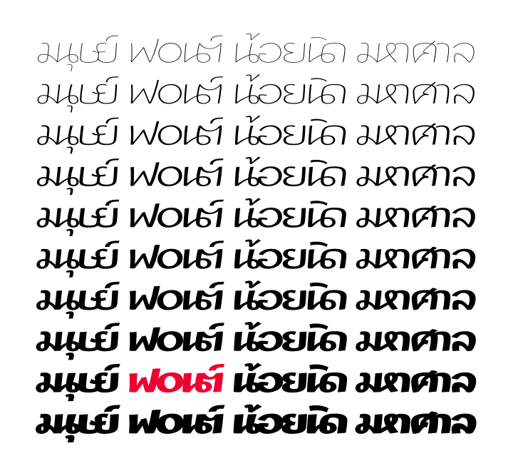

**ฟ๐นต์** เป็นฟอนต์ที่ได้รับแรงบันดาลใจจากโลโก้ [f0nt.com](http://f0nt.com) แต่ยัง **อยู่ระหว่างการจัดทำ** และทดลองฟีเจอร์ที่ซับซ้อน โดยตั้งใจให้เป็นฟอนต์ปากกามาร์กเกอร์ 10 น้ำหนัก และใส่ฟีเจอร์ Ligature เพื่อเชื่อมตัวอักษรไทยบางตัวให้เป็นตัวเดียวกัน เช่น นด นต มน มห ษย เป็นต้น

-----

### ๏ ทดสอบการแสดงผล
{: .f0nt-700}

- [หน้าทดสอบ OpenType features](features.html) เป็นสไลด์โชว์ที่เปลี่ยนน้ำหนักและสไตล์ของฟอนต์ได้ตรงมุมบนด้านขวาสุดในหน้านั้น

-----

### ๏ ซอฟต์แวร์ที่รองรับ
{: .f0nt-700 #softwares}

- โปรแกรมที่จะสามารถใช้งานฟีเจอร์ของฟอนต์ **ฟ๐นต์** ได้โดยไม่มีปัญหา ต้องรองรับ OpenType เป็นอย่างดีถึงดีมาก สำหรับระบบปฏิบัติการทั่วไป ผมทดสอบใน GNU desktop กับ Mac OS แล้วปกติดี คาดว่าใน Windows ก็ไม่น่ามีปัญหา  
- สำหรับสาวก Adobe ต้องเปิดใช้ **World-Ready Composer** เพื่อให้โปรแกรมรองรับฟีเจอร์ที่ซับซ้อนของฟอนต์นี้ หรือในกรณีของ Photoshop ต้องเปิดใช้ [Middle Eastern features](https://helpx.adobe.com/photoshop/using/arabic-hebrew.html) ([ดูภาพตัวอย่าง](https://forums.adobe.com/message/8627289#8627289)) ถ้าจะให้ดีควรติดตั้งเวอร์ชั่น Middle East ไปเลยครับ เพราะมันมีความสามารถสูงกว่าเวอร์ชั่น US และเหมาะกับวิธีเขียนภาษาไทยและภาษาอื่นๆ ในภูมิภาคนี้

-----

### ๏ สัญญาอนุญาต
{: .f0nt-700}

&copy; ๒๕๕๙ [สังศิต ไสววรรณ](https://sungsit.com/)

&copy; ๒๕๕๙ [ปรัชญา สิงห์โต](http://iannnnn.com/) พร้อมสงวนชื่อฟอนต์ "F0NT" (หรือ "ฟ๐นต์" ในภาษาไทย)

ฟอนต์ **ฟ๐นต์** ใช้สัญญาอนุญาต (license) แบบ [SIL Open Font License v1.1](http://scripts.sil.org/OFL) แปลว่าคุณมีอิสระเต็มที่ในการใช้งาน ดัดแปลง หรือปรับปรุง เงื่อนไขคือเมื่อดัดแปลงจากต้นแบบแล้วอยากจะเผยแพร่ผลงานใหม่ก็ต้องใช้สัญญาอนุญาตแบบเดียวกันและต้องเปิดเผยซอร์สโค้ดเช่นกัน

ซอร์สโค้ดล่าสุดอยู่ที่ [github.com/fontuni/f0nt](https://github.com/fontuni/f0nt)

-----

### ๏ แนะนำ ติชม และให้ความเห็น
{: .f0nt-700}

หากคุณมีข้อเสนอสำหรับจัดทำฟีเจอร์ก็คุยกันได้ที่ [github.com](https://github.com/fontuni/f0nt/issues) หรือติดตามความ(ไม่)คืบหน้าใน [ฟ๐นต์เว็บบอร์ด](http://www.f0nt.com/forum/index.php/topic,23017.0.html) ก็ได้ครับ

